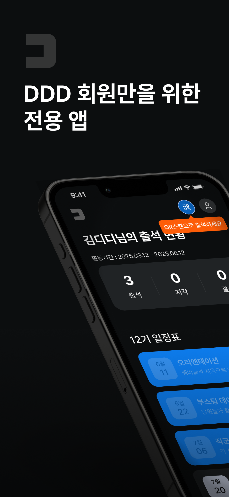
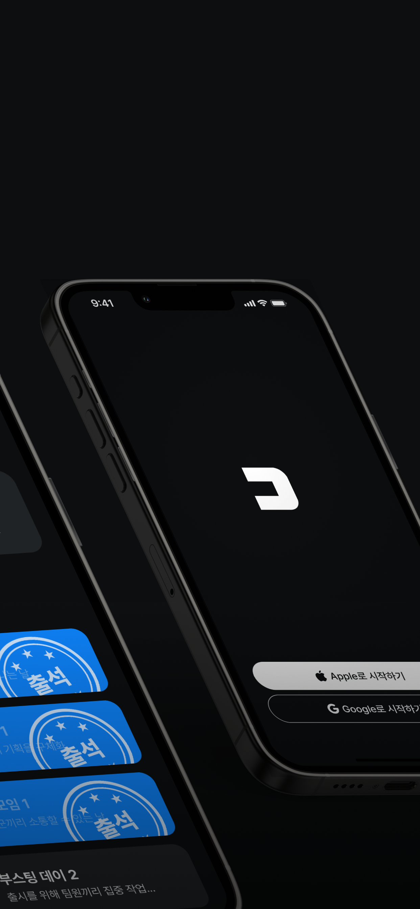
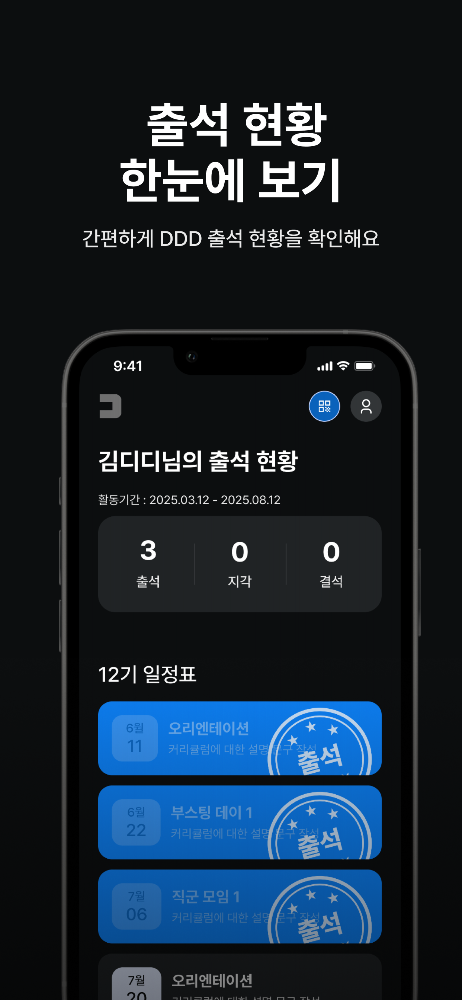
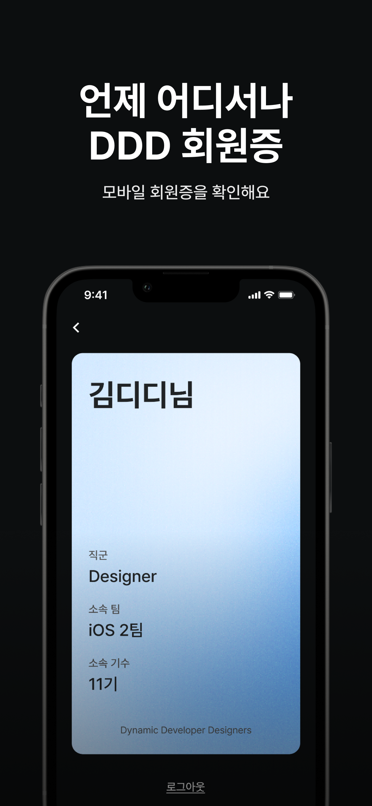
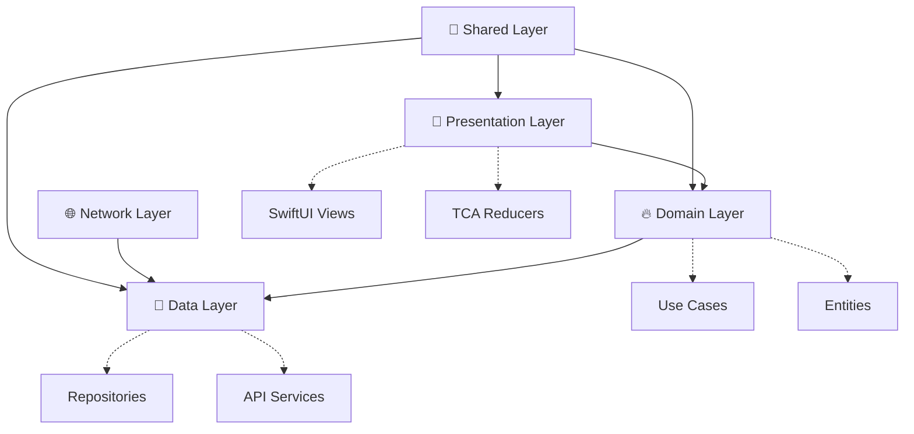
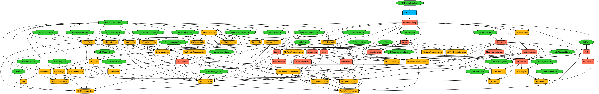

# DDD 출석 iOS

<div align="center">


**효율적인 스터디 관리, 스마트한 출석 체크 시스템**


[📱 App Store](https://apps.apple.com/kr/app/ddd/id6736766383) | [🎯 Features](#-주요-기능) | [🏗 Architecture](#-프로젝트-아키텍처) | [🚀 Quick Start](#-빠른-시작)

---

</div>

## 📖 프로젝트 소개

**DDD 출석**은 개발자 스터디 그룹의 출석 관리를 효율적으로 도와주는 iOS 애플리케이션입니다.
간단하고 직관적인 인터페이스로 스터디원들의 출석 현황을 관리하고, 스터디 운영을 체계화할 수 있도록 지원합니다.

> 💡 **우리는 왜 이 앱을 만들었을까요?**
> 스터디 출석 관리를 위한 번거로운 과정을 줄이고,
> 개발자들이 학습에 더 집중할 수 있는 환경을 만들고자 합니다.

### 📱 스크린샷

<div align="center">

| 스플래시 | 로그인 | 출석 현황 |
|:---:|:---:|:---:|
|  |  |  |

| 프로필 | 설정 |
|:---:|:---:|
|  |  |

</div>

## ✨ 주요 기능

### 🔐 간편한 인증
- **Google OAuth 2.0**: 간단한 구글 계정 로그인
- **자동 로그인 유지**: 재실행 시 자동 인증 상태 유지
- **보안 강화**: OAuth 2.0 기반 안전한 인증 시스템

### 📊 출석 관리
- **실시간 출석 체크**: 빠르고 정확한 출석 확인
- **출석 상태 관리**: 출석, 지각, 결석, 대기 상태 구분
- **출석 이력 조회**: 개인별 출석 현황 및 통계
- **출석률 통계**: 시각적 통계 정보 제공

### 👥 멤버 관리
- **스터디 멤버 목록**: 전체 참가자 현황 확인
- **멤버 상태 조회**: 각 멤버의 출석 패턴 분석
- **관리자 권한**: 스터디 운영진을 위한 관리 기능

### 📱 사용자 경험
- **직관적 UI/UX**: 간단하고 명확한 인터페이스
- **실시간 동기화**: 서버와의 실시간 데이터 동기화
- **오프라인 지원**: 네트워크 없이도 기본 기능 사용 가능
- **다크 모드**: 시스템 설정에 따른 다크/라이트 모드 지원

## 🏗 프로젝트 아키텍처

### 🎯 Clean Architecture with Tuist

```
DDD-Attendance-iOS/
├── 📱 Projects/
│   ├── App/                     # 메인 애플리케이션 타겟
│   │   ├── Sources/
│   │   │   ├── Application/     # AppDelegate, SceneDelegate
│   │   │   ├── Di/             # Dependency Injection
│   │   │   ├── Reducer/        # TCA Root Reducer
│   │   │   └── View/           # Root Views
│   │   ├── Resources/          # Assets, Fonts, Localizations
│   │   └── Tests/              # App 레벨 테스트
│   │
│   ├── Presentation/           # 🎨 UI Layer
│   │   ├── Auth/               # 로그인/인증 화면
│   │   ├── Splash/             # 스플래시 화면
│   │   ├── OnBoarding/         # 온보딩 화면
│   │   ├── Management/         # 출석 관리 화면
│   │   ├── Member/             # 멤버 관리 화면
│   │   ├── Profile/            # 프로필 화면
│   │   ├── Web/                # 웹뷰 화면
│   │   └── Presentation/       # 공통 프레젠테이션 유틸
│   │
│   ├── Domain/                 # 🔥 Business Logic Layer
│   │   ├── Entity/             # 도메인 엔티티
│   │   ├── UseCase/            # 비즈니스 로직 구현
│   │   └── RepositoryInterface/ # Repository 프로토콜
│   │
│   ├── Data/                   # 📡 Data Layer
│   │   ├── Repository/         # Repository 구현체
│   │   ├── DataSource/         # 로컬/원격 데이터소스
│   │   └── Model/              # DTO, Response Models
│   │
│   ├── Network/                # 🌐 Network Layer
│   │   ├── Foundation/         # 네트워크 기반 설정
│   │   ├── Service/            # API 서비스 구현
│   │   └── Configuration/      # 네트워크 설정
│   │
│   └── Shared/                 # 🔧 Shared Layer
│       ├── DesignSystem/       # 디자인 시스템
│       ├── Utility/            # 공통 유틸리티
│       └── Extension/          # Swift Extensions
│
└── 🔧 Tuist/                   # 프로젝트 설정
    ├── Package.swift
    ├── ProjectDescriptionHelpers/
    └── Dependencies.swift
```

### 🏛️ Clean Architecture Pattern



### 📊 의존성 그래프 (Tuist Graph)

<div align="center">



</div>

*프로젝트 모듈 간 의존성 관계도 (자동 생성)*

### 🔄 의존성 방향 원칙

```
Presentation → Domain (UseCase Protocol)
       ↓
Domain/UseCase → Domain (Repository Protocol)
       ↓
Data/Repository → Domain (Entity + Repository Protocol)
       ↓
Network/Service → Data (API 통신)
```

**핵심 설계 원칙:**
- ✅ **Presentation**은 Domain의 UseCase만 의존
- ✅ **Domain**은 외부 계층에 의존하지 않는 순수 비즈니스 로직
- ✅ **Data**는 Domain의 Entity와 Repository Protocol을 구현
- ✅ 모든 데이터 흐름은 **Domain을 중심**으로 진행

## 🛠 기술 스택

### Core Technologies
- **🎯 Architecture**: The Composable Architecture (TCA) 1.18.0
- **📦 Modularization**: Tuist 4.x (Micro Feature Architecture)
- **💉 Dependency Injection**: WeaveDI 3.4.0
- **🔀 Navigation**: TCACoordinators 0.11.1
- **⚡ Concurrency**: Swift Concurrency (async/await)

### Key Dependencies
- **ComposableArchitecture** 1.18.0: 상태 관리 및 단방향 데이터 플로우
- **TCACoordinators** 0.11.1: TCA 기반 화면 전환 및 네비게이션
- **WeaveDI** 3.4.0: 의존성 주입 컨테이너 (커스텀 포크)
- **GoogleSignIn** 9.0.0: Google OAuth 2.0 인증
- **Firebase** 12.7.0: 백엔드 서비스 (Analytics, Crashlytics)
- **AsyncMoya** 1.1.8: async/await 기반 네트워킹 (커스텀 포크)
- **AppAuth** 2.0.0: OAuth 2.0 및 OpenID Connect 클라이언트

### UI & UX
- **🎨 UI Framework**: SwiftUI + SwiftUIX 0.2.3
- **🖼️ Image Loading**: SDWebImageSwiftUI 2.0.0
- **🎨 Design System**: 커스텀 DesignSystem 모듈
- **📱 Responsive Design**: 모든 iOS 기기 대응

### Networking & Data
- **🌐 HTTP Client**: AsyncMoya 1.1.8 (Moya + async/await)
- **📱 API Architecture**: RESTful API with JSON
- **💾 Local Storage**: UserDefaults, Keychain
- **🔄 State Management**: TCA Store
- **🔥 Backend Services**: Firebase 12.7.0

### Development Tools
- **📊 Analytics & Logging**: Firebase Analytics + LogMacro
- **🔧 Build Tool**: Tuist + SPM (Swift Package Manager)
- **🧪 Testing**: XCTest + TCA Testing + XCTestDynamicOverlay
- **📱 Automation**: fastlane (스크린샷, 배포)
- **⚡ Performance**: Swift 6.0 + Concurrency Extras
- **🐛 Crash Reporting**: Firebase Crashlytics

## 🚀 빠른 시작

### ✅ 필수 요구사항

- **💻 Xcode**: 16.0 이상
- **📱 iOS**: 17.0 이상
- **⚡ Swift**: 6.0 이상
- **🔧 Tuist**: 4.x 이상

### 🛠 설치 및 실행

#### 1️⃣ 저장소 클론
```bash
git clone https://github.com/Roy-wonji/DDD-Attendance-iOS.git
cd DDD-Attendance-iOS
```

#### 2️⃣ Tuist 설치
```bash
curl -Ls https://install.tuist.io | bash
```

#### 3️⃣ 프로젝트 빌드 및 생성
```bash
# 전체 워크플로우 (권장)
./make build      # clean → install → generate

# 또는 단계별 실행
./make clean      # 기존 파일 정리
./make install    # 의존성 설치
./make generate   # 프로젝트 생성
```

#### 4️⃣ Xcode에서 실행
```bash
open DDDAttendance.xcworkspace
```

### ⚙️ 환경 설정

프로젝트 실행을 위해 다음 설정이 필요합니다:

```swift
// Config 파일에서 설정 (Dev.xcconfig, Prod.xcconfig)
BASE_URL = api.dddstudy.kr/
GOOGLE_CLIENT_ID = YOUR_GOOGLE_CLIENT_ID
GOOGLE_IOS_CLIENT_ID = YOUR_GOOGLE_IOS_CLIENT_ID
REVERSED_CLIENT_ID = YOUR_REVERSED_CLIENT_ID
```

## 🛠️ 주요 명령어

### 🔄 기본 워크플로우
```bash
./make build      # 전체 빌드 프로세스 (권장)
./make generate   # 프로젝트 생성만
./make clean      # 빌드 아티팩트 정리
./make install    # 의존성 설치
```

### 🚨 문제 해결
```bash
tuist clean       # Tuist 캐시 정리
./make clean      # 모든 빌드 파일 정리
```

### 🔍 코드 품질 관리
```bash
tuist graph       # 의존성 그래프 생성
tuist test        # 전체 테스트 실행
```

### 📱 fastlane 자동화
```bash
fastlane ios beta               # TestFlight 배포
fastlane ios release            # App Store 배포
fastlane ios screenshots        # 스크린샷 자동 생성
fastlane ios build_for_testing  # 테스트 빌드
```

**fastlane 주요 기능:**
- 자동화된 빌드 및 배포
- App Store Connect 관리
- 인증서 및 프로필 관리
- 스크린샷 자동 생성

## 📋 사용법

### 1️⃣ 초기 설정
1. **앱 다운로드 및 설치**
2. **Google 계정으로 로그인**
3. **권한 설정** (푸시 알림 등)

### 2️⃣ 출석 체크
1. **출석 탭**에서 현재 스터디 세션 확인
2. **출석 체크** 버튼 터치
3. **출석 상태** 자동 업데이트 (출석/지각/결석/대기)

### 3️⃣ 출석 현황 조회
1. **통계 탭**에서 개인 출석률 확인
2. **달력 뷰**로 월별 출석 패턴 확인
3. **상세 이력** 조회 가능

### 4️⃣ 프로필 관리
1. **프로필 탭**에서 개인 정보 확인
2. **설정** 메뉴에서 앱 환경 설정
3. **로그아웃** 및 계정 관리

## 📄 라이선스

이 프로젝트는 **MIT 라이선스** 하에 배포됩니다.
자세한 내용은 [LICENSE](LICENSE) 파일을 참고하세요.

## 👥 팀 & 크레딧

### 💻 개발팀
- **iOS Lead Developer**: 서원지 ([@Roy-wonji](https://github.com/Roy-wonji))
- **iOS Developer**: 홍은표 ([@honghoker](https://github.com/honghoker))

### 🛠 기술 스택
- **iOS**: 
  
  
  

- **Server**: 
  
  
  

- **Design**: 
  

- **VCS**: 
  
  

## 🐈‍⬛ Git 브랜칭 전략

### 1️⃣ Git Branching Strategy

- **Main Branch**: 프로덕션 배포용
- **Develop Branch**: 개발 통합 브랜치  
- **Feature Branch**: 기능별 개발 브랜치

### 📋 워크플로우
1. **Develop** 브랜치에서 **Feature** 브랜치 생성
2. **Feature** 브랜치에서 개발 진행
3. **Feature** → **Develop** Pull Request
4. 코드 리뷰 및 충돌 해결 후 머지
5. **Develop** → **Main** 배포용 Pull Request

## 📞 문의 및 지원

- 📧 **이메일**: suhwj81@gmail.com
- 🐛 **버그 신고**: [Issues](https://github.com/Roy-wonji/DDD-Attendance-iOS/issues)
- 💡 **기능 제안**: [Discussions](https://github.com/Roy-wonji/DDD-Attendance-iOS/discussions)
- 📱 **App Store**: [DDD 출석 다운로드](https://apps.apple.com/kr/app/ddd/id6736766383)

---

<div align="center">

**Made with ❤️ by DDD Team**

[](https://github.com/Roy-wonji/DDD-Attendance-iOS)

</div>
