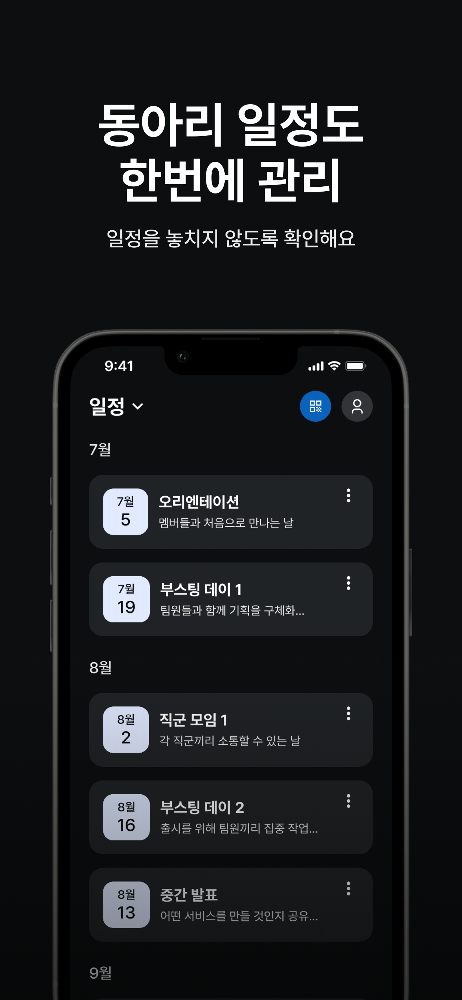

# DDD 출석 iOS

**DDD 동아리의 출석·일정·투표 운영을 위한 iOS 앱**

[앱 스토어](https://apps.apple.com/kr/app/ddd/id6736766383) · [아키텍처](#아키텍처) · [빠른 시작](#빠른-시작) · [개발 명령어](#개발-명령어)

## 프로젝트

DDD 출석은 멤버와 운영진이 한 앱에서 일정과 출석 현황을 확인하고, QR 출석·투표·프로필 관리를 수행할 수 있도록 만든 앱입니다.

주요 기능:

- Apple·Google OAuth 로그인과 토큰 재발급
- 멤버 출석 일정, 출석·지각·결석 현황 조회
- 운영진 출석 현황 및 멤버 관리
- QR 코드 기반 출석 확인
- 활성 투표 조회·응답
- 프로필, 기수·팀 정보, 로그아웃·회원 탈퇴 관리

## 스크린샷

| 메인 | 로그인 | 출석 관리 |
|:---:|:---:|:---:|
|  |  |  |

| 출석 멤버 | 프로필 | 일정 |
|:---:|:---:|:---:|
|  |  |  |

## 아키텍처

SwiftUI와 The Composable Architecture를 기반으로 한 Clean Architecture 멀티모듈 프로젝트입니다. Tuist가 프로젝트 생성, 모듈 의존성, Stage 전체 테스트 스킴을 관리합니다.

~~~text
Projects/
├── App/                         # 앱 진입점, 루트 Reducer·Coordinator
├── Feature/
│   ├── FeatureAssembly/         # 전체 Feature와 Data 구현을 앱에 제공
│   ├── FeatureSharedUI/         # Feature 공통 UI
│   ├── Auth/                    # 로그인
│   ├── Splash/                  # 앱 진입 및 사용자 분기
│   ├── OnBoarding/              # 신규 사용자 등록
│   ├── Management/              # 운영진 출석·투표 관리
│   ├── Member/                  # 멤버 출석·투표
│   ├── Profile/                 # 프로필·계정 관리
│   └── Web/                     # 웹 화면
├── Domain/
│   ├── DomainAssembly/          # Domain 단일 진입점
│   ├── Entity/                  # 비즈니스 엔티티
│   ├── DomainInterface/         # Repository 계약과 테스트 기본값
│   └── UseCase/                 # 비즈니스 유스케이스
├── Data/
│   ├── DataAssembly/            # Repository 라이브 구현 등록
│   ├── Model/                   # DTO와 Entity 변환
│   └── Repository/              # Repository 구현·로컬 데이터 소스
├── Service/
│   ├── ServiceAssembly/         # 인증·저장소·네트워크 조립
│   ├── API/                     # API 경로 상수
│   ├── APIEndpoint/             # DDDNetwork 요청 명세
│   └── DDDAuth/                 # 인증 세션과 토큰 갱신
├── Core/
│   ├── CoreAssembly/            # Core 구현 묶음
│   ├── DDDNetwork/              # Alamofire 기반 HTTP 클라이언트
│   ├── DDDStorage/              # Keychain 저장소
│   ├── DDDCoreLogger/           # os.Logger 기반 로깅
│   ├── DDDCoreUtility/          # 공통 Swift·TCA 유틸리티
│   ├── DDDCoreUI/               # UI 기반 타입
│   └── DDDThirdParty/           # 외부 UI 패키지 재노출
├── UI/
│   ├── DDDDesignKit/            # 디자인 토큰·컴포넌트·리소스
│   ├── DDDSharedUI/             # 앱 공통 화면 컴포넌트
│   └── DDDAnimation/            # 이미지·애니메이션 리소스
└── TestHost/                    # TCA 모듈 테스트용 경량 호스트
~~~

### 의존성 흐름

~~~mermaid
flowchart TD
    App --> FeatureAssembly
    FeatureAssembly --> Features[Feature modules]
    FeatureAssembly --> DataAssembly

    Features --> DomainAssembly
    Features --> UI[UI modules]

    DataAssembly --> Repository
    DataAssembly --> Model
    DataAssembly --> DomainAssembly
    DataAssembly --> ServiceAssembly

    Repository --> DomainInterface
    Repository --> Entity
    Repository --> APIEndpoint
    Repository --> NetworkInterface[DDDNetworkInterface]

    DomainAssembly --> UseCase
    DomainAssembly --> DomainInterface
    DomainAssembly --> Entity

    ServiceAssembly --> CoreAssembly
    ServiceAssembly --> DDDAuth
    DDDAuth --> DDDNetwork
    DDDAuth --> StorageInterface[DDDStorageInterface]
~~~

설계 원칙:

- App은 세부 구현 대신 **FeatureAssembly** 하나를 진입점으로 사용합니다.
- Feature는 **DomainAssembly**를 통해 UseCase와 Domain 계약을 사용합니다.
- Domain은 Data·Service 구현을 알지 않습니다.
- Data는 Domain의 Repository 계약을 구현하며 Service와 Core의 인터페이스에 의존합니다.
- **DDDNetwork**와 **DDDStorage**는 Interface/Implementation 타깃을 분리합니다.
- 리소스를 포함하는 **DDDDesignKit**, **DDDAnimation**은 동적 프레임워크이며 나머지 내부 모듈은 기본적으로 정적 프레임워크입니다.

### 의존성 주입

별도 런타임 DI 컨테이너 대신 Point-Free Dependencies를 사용합니다.

- **DomainInterface**: Repository를 TestDependencyKey로 선언
- **UseCase**: UseCase의 DependencyKey와 라이브 구현 제공
- **DataAssembly**: Repository 계약에 Data 라이브 구현 등록
- **ServiceAssembly**: 인증 세션, Keychain, Network 구현 조립
- **FeatureAssembly**: Feature와 Data 조립 결과를 App에 재노출

### 모듈 그래프

~~~bash
./make graph       # 외부 패키지를 제외하고 Tests·Demo를 포함한 전체 모듈 그래프
./make graph:prod  # 외부 패키지와 Tests·Demo를 제외한 제품 그래프
~~~

## 기술 스택

| 영역 | 기술 |
|---|---|
| 언어 | Swift 6, Swift Concurrency |
| UI | SwiftUI |
| 상태 관리 | The Composable Architecture 1.25.5 |
| 내비게이션 | TCAFlow 1.1.3 |
| 프로젝트 | Tuist 4.206.0, Mise |
| 의존성 주입 | Point-Free Dependencies |
| 네트워크 | DDDNetwork, Alamofire 5.12.0 |
| 인증 | Sign in with Apple, GoogleSignIn 9.2.0, AppAuth 2.1.0 |
| 저장소 | DDDStorage, Keychain |
| 이미지 | SDWebImageSwiftUI 3.1.4, SwiftUIX 0.2.3 |
| 모니터링 | Firebase Crashlytics 12.12.0 |
| 테스트 | Swift Testing, Tuist Test Insights |

### 로깅과 진단

- **DDDCoreLogger**: os.Logger 기반 자체 로거이며 로그 값은 `.private`로 기록
- **IssueReporting**: TCA 의존성 그래프에서 개발 단계 문제 보고를 담당
- **XCTestDynamicOverlay**: 앱 코드의 테스트 assertion을 XCTest 환경과 연결

지원 환경:

- iOS 17.0 이상
- Swift 6
- Xcode 26 이상
- iPhone

## 빌드 환경

프로젝트는 Dev 없이 두 구성만 사용합니다.

| 구성 | 용도 | 스킴 |
|---|---|---|
| Stage | 로컬 개발, 시뮬레이터, CI 전체 테스트 | DDDAttendance-Stage |
| Prod | 배포·아카이브 | DDDAttendance-Prod |

공통 값은 Config/base.xcconfig, 환경 값은 Config/Stage.xcconfig와 Config/Prod.xcconfig에서 관리합니다. Google 설정 파일은 Projects/App/Resources/GoogleService-Info.plist에 둡니다. 저장소에 포함되지 않는 설정 파일은 팀의 안전한 공유 경로 또는 GitHub Actions Secret에서 복원해야 합니다.

## 빠른 시작

### 요구사항

- Xcode 26 이상
- Homebrew
- 프로젝트 설정 파일과 GoogleService-Info.plist

### 설치

~~~bash
git clone https://github.com/DDD-Community/Attendance_iOS.git
cd Attendance_iOS

# Mise 도구 설치 → Tuist 의존성 설치 → 워크스페이스 생성
./make setup

open DDDAttendance.xcworkspace
~~~

Xcode에서 **DDDAttendance-Stage** 스킴과 사용할 iPhone 시뮬레이터를 선택해 실행합니다.

## 개발 명령어

~~~bash
./make setup                     # Mise 도구, 의존성, 워크스페이스 준비
./make generate                  # Demo 앱을 포함해 Xcode 프로젝트 생성
./make build                     # clean → install → generate
./make install                   # 의존성 설치 후 generate
./make test                      # 전체 테스트
./make cache                     # Tuist 바이너리 캐시 생성
./make format                    # SwiftFormat 적용
./make lint                      # SwiftFormat 검사
./make clean                     # 생성 프로젝트 정리
./make reset                     # DerivedData 정리 후 프로젝트 재생성
~~~

새 모듈 생성:

~~~bash
./make feature <이름>
./make core <이름>
./make service <이름>
./make data <이름>
./make domain <이름>
./make ui <이름>

# 자동으로 만든 카탈로그 case가 원하는 이름과 다를 때
./make feature <이름> --case <케이스명>
~~~

모듈 생성 명령은 scaffold뿐 아니라 모듈 카탈로그와 해당 레이어 Assembly 의존성도 함께 갱신합니다.

## 테스트와 CI

- **DDDAttendance-Stage** workspace 스킴은 Projects/**/Tests를 자동 수집합니다.
- 코드 커버리지는 workspace의 관련 타깃만 집계합니다.
- PR 워크플로는 self-hosted 러너에서 Stage 전체 테스트, PR 커버리지, Bundle Insights를 생성합니다.
- 테스트는 `tuist test`와 `--inspect-mode remote`로 실행하고 결과를 [Tuist 웹 프로젝트](https://tuist.dev/DDD2026/attendance)에 업로드합니다.
- Tuist Test Insights에서 모듈별 테스트 케이스, 성공·실패, 실행 시간, flaky test와 quarantine 상태를 확인합니다.
- develop 워크플로는 Tuist Test Sharding으로 테스트를 분산하고 동일한 Test Run에 shard 결과를 수집합니다.
- Build Insights에서 빌드 상태와 시간을, Bundle Insights에서 앱 설치 크기와 증감을 확인합니다.
- Xcode Compilation Cache와 Tuist 외부 패키지 바이너리 캐시를 사용합니다.

Tuist 웹 리포트:

- [Tests](https://tuist.dev/DDD2026/attendance/tests/test-runs): 테스트 실행과 테스트 케이스
- [Builds](https://tuist.dev/DDD2026/attendance/builds/build-runs): 빌드 성공 여부와 빌드 시간
- [Bundles](https://tuist.dev/DDD2026/attendance/bundles): 앱 번들 크기와 변경 추이

관련 워크플로:

- .github/workflows/ios-pr-coverage.yml
- .github/workflows/ios-develop-sharded-tests.yml
- .github/workflows/ios-cache-warm.yml

## 개발 가이드

- [TCA 패턴](docs/agent/tca-patterns.md)
- [SwiftUI 패턴](docs/agent/swiftui-patterns.md)
- [Swift 코딩 규칙](docs/agent/swift-coding-rules.md)
- [팝업과 모달](docs/agent/popup-modal-system.md)
- [TCAFlow 내비게이션](docs/agent/tcaflow-navigation.md)
- [개발 환경](docs/agent/development-environment.md)
- [Git 워크플로](docs/agent/git-workflow.md)

프로젝트 운영 규칙과 AI 에이전트 지침은 [AGENTS.md](AGENTS.md)를 기준으로 합니다.

## 브랜치 전략

- **main**: 프로덕션 배포
- **develop**: 개발 통합
- 기능·수정 브랜치 → develop Pull Request

## 문의

- [GitHub Issues](https://github.com/DDD-Community/Attendance_iOS/issues)
- [GitHub Discussions](https://github.com/DDD-Community/Attendance_iOS/discussions)
- [App Store](https://apps.apple.com/kr/app/ddd/id6736766383)

Made with ❤️ by DDD

